# Landing page in next js

## Table of Contents

1. [Project Overview](#project-overview)
2. [Features](#features)
   - [Interactive Pop-Ups](#interactive-pop-ups)
   - [Author Section](#author-section)
   - [Course Points and Features](#course-points-and-features)
   - [Bonuses Section](#bonuses-section)
   - [Product Comparison Section](#product-comparison-section)
   - [FAQs Section](#faqs-section)
   - [Guarantee](#guarantee)
   - [Free Trial (Demo)](#free-trial-demo)
3. [Technologies Used](#technologies-used)
4. [Static Content and Media Management](#static-content-and-media-management)
   - [Adding Images in AWS](#adding-images-in-aws)
5. [Styling](#styling)
6. [CDN for Images](#cdn-for-images)
7. [Hosting](#hosting)
8. [License](#license)

## Project Overview

This landing page is designed to provide a comprehensive platform for promoting and selling the "Libertad Digital" course. The site includes various features aimed at enhancing user engagement and driving conversions, following the principles outlined in Alex Hormozi's "100M Offers" and Russell Branson's "Dotcom Secrets."

## Features

View on desktop:
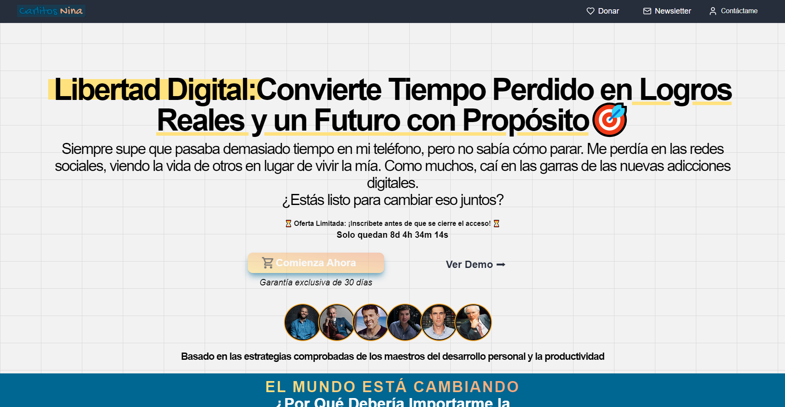

View on mobile:

### Interactive Pop-Ups

To maximize sales, the website utilizes interactive pop-ups. These pop-ups deliver targeted messages and offers to visitors, encouraging them to take action, such as signing up for the course or taking advantage of limited-time discounts.

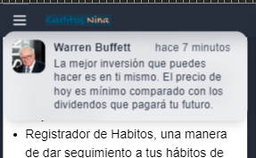

### Authors Section

The author section provides social validation by showcasing the credibility and expertise of Book authros. This section includes a detailed biography, accomplishments, and testimonials from authors of many books, reinforcing trust and authenticity.

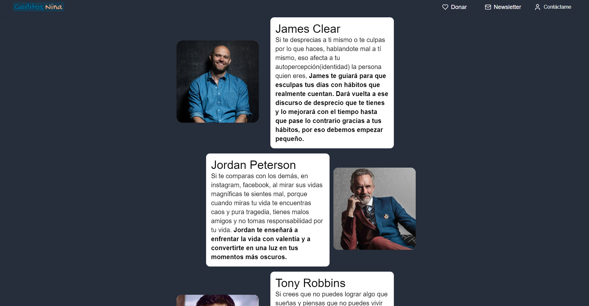

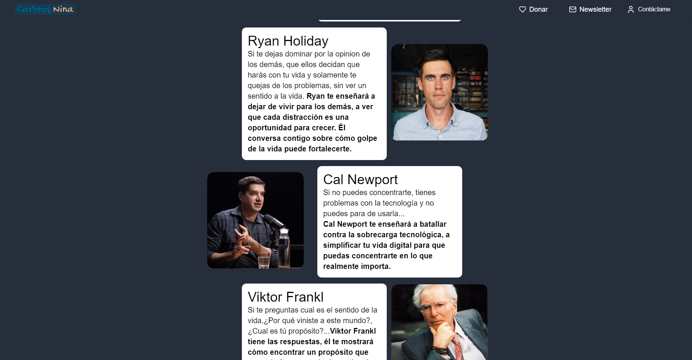

### Course Points and Features

This section highlights the key points and features of the "Libertad Digital" course. It breaks down the course into easy-to-understand modules, outlining what users will learn and how it will benefit them in their journey to digital detox and personal growth.

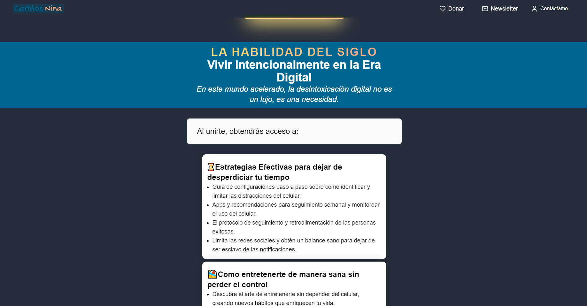

### Bonuses Section

To add more value, the bonuses section lists all the exclusive bonuses that come with the course. These bonuses include additional resources, templates, and access to a private community, enhancing the overall offer and making it more appealing.

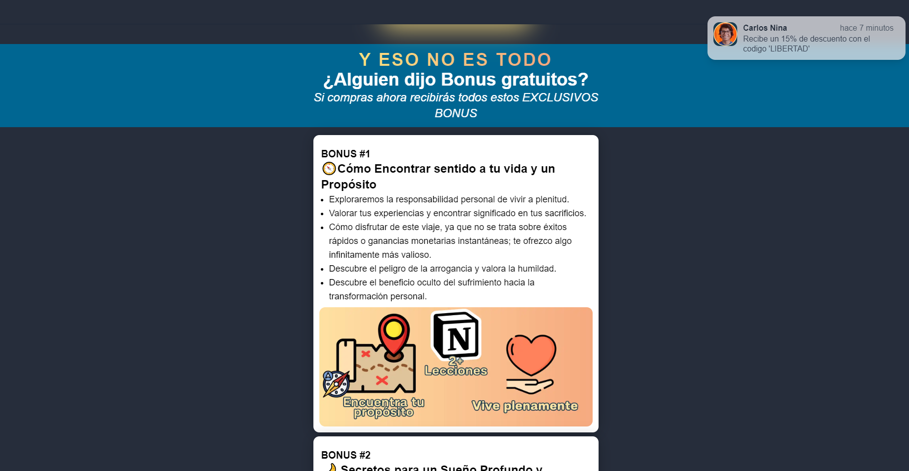

### Product Comparison Section

A product comparison section is included to highlight the advantages of "Libertad Digital" over other similar products. This section uses clear, concise comparisons to showcase the unique features and superior value of the course.

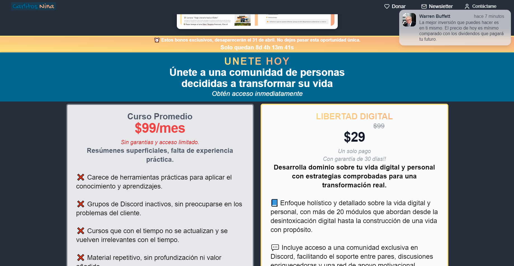

gned to remove any doubts and provide clear, reassuring answers to help users make an informed decision.

### Guarantee

To help users feel more secure in their purchase, the website offers a 30-day money-back guarantee. This guarantee provides peace of mind, showing users that their satisfaction is the top priority.

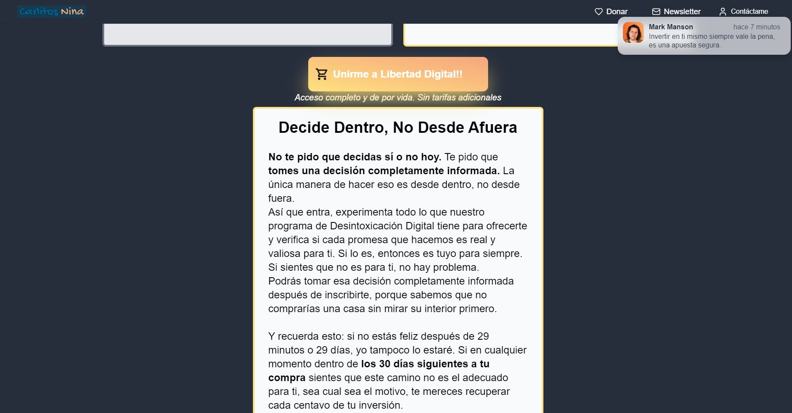

### Checkout

A checkout page with Lemon Squeezy, with the price of the product

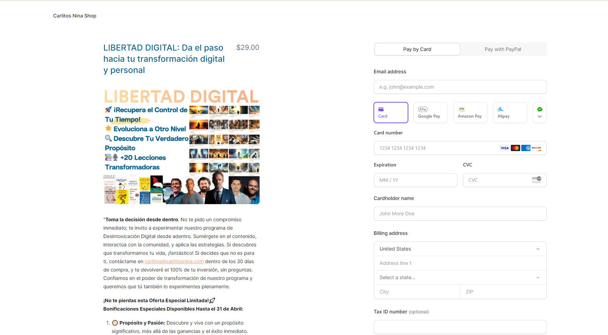

### FAQs Section

The FAQs section addresses common questions and concerns potential customers might have. This section is desi

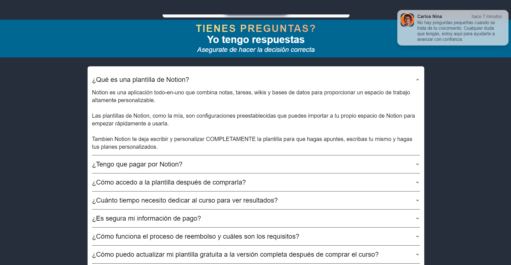

### Free Trial (Demo)

A free trial or demo of the course is available to give potential customers a taste of what they can expect. This allows them to experience the value of the course firsthand before committing to a purchase.

## Technologies Used

The Carlitos Nina web page is built using cutting-edge technologies to ensure a seamless and responsive user experience:

- **Next.js:** For server-side rendering and static site generation.
- **Tailwind CSS:** For utility-first CSS styling.
- **Next UI:** For pre-built UI components.
- **Shadcn:** For additional styling and component functionalities.
- **Shadcn Extension:** For extended features and styles.

## Static Content and Media Management

### Adding Images in AWS

To manage images, mp4 videos, and other static content with proper caching in AWS:

1. **Change File Names:** For any new content or updates, ensure you change the file name to enforce the cache.
2. **Configure Metadata:** Set appropriate metadata for each new or updated element.

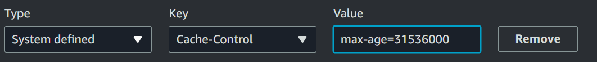

### Content Management System

- **Lemon JS:** Applied to the product "Libertad Digital."
- **Lemon Squeezy:** Used as the payment method for the product on sale.

## Styling

The website utilizes the following styling frameworks and extensions:

- **Tailwind CSS:** For utility-first CSS.
- **Next UI:** For UI components.
- **Shadcn:** For additional styling and components.
- **Shadcn Extension:** For extended functionalities.

## CDN for Images

To efficiently serve images, the following CDN configurations are used:

- **S3:** For storage.
- **CloudFront:** For content delivery.

## Hosting

The website is hosted on:

- **Vercel:** For seamless deployment and hosting.

---

**Carlitos Nina**
© 2024 Carlos Nina. All rights reserved.
